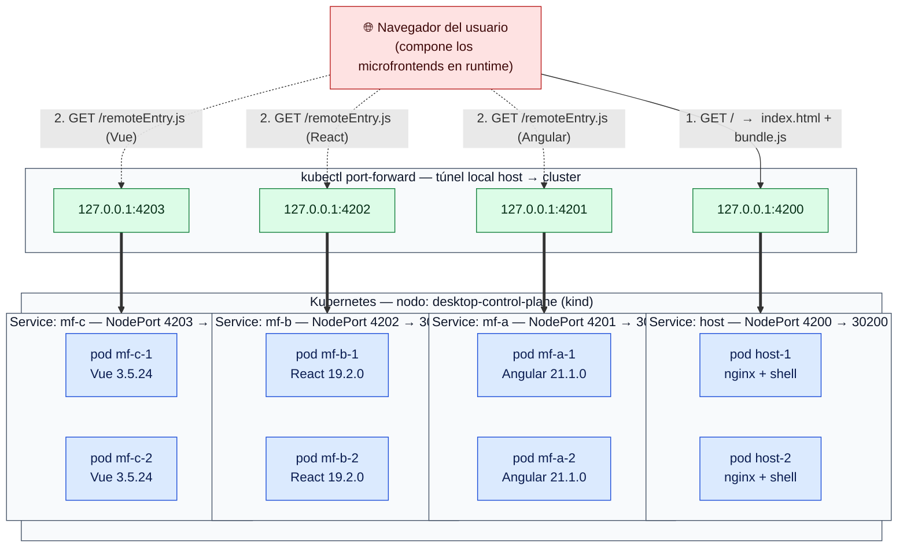

# Arquitectura — Escenario Module Federation en Kubernetes

Estado actual desplegado en el cluster local (Docker Desktop / kind, nodo `desktop-control-plane`).

> Para ver el diagrama renderizado en VS Code: abrir este archivo y pulsar `Ctrl+Shift+V` (Markdown Preview).



## Componentes

| Componente | Framework | Imagen Docker | Réplicas | Service | Puerto contenedor | NodePort |
|---|---|---|---|---|---|---|
| **host** | vanilla JS (shell MF) | `mf-host:latest` | 2 | NodePort | 4200 | 30200 |
| **mf-a** | Angular 21.1.0 | `mf-a-mf:latest` | 2 | NodePort | 4201 | 30201 |
| **mf-b** | React 19.2.0 | `mf-b-mf:latest` | 2 | NodePort | 4202 | 30202 |
| **mf-c** | Vue 3.5.24 | `mf-c-mf:latest` | 2 | NodePort | 4203 | 30203 |

Todos los Deployments usan:
- `replicas: 2`
- `strategy: RollingUpdate (maxSurge: 1, maxUnavailable: 0)`
- `restartPolicy: Always`
- `imagePullPolicy: IfNotPresent`
- `readinessProbe` + `livenessProbe` HTTP GET `/`
- `resources: requests 50m CPU / 64Mi RAM — limits 250m / 256Mi`

## Flujo de carga (composición en el cliente)

1. El navegador pide `http://localhost:4200/` → el Service `host` lo enruta a uno de los 2 pods `host`, que devuelve `index.html` + `bundle.<hash>.js`.
2. El bundle del host contiene URLs **hardcodeadas** en build time:
   - `mfa: mfA@http://localhost:4201/remoteEntry.js`
   - `mfb: mfB@http://localhost:4202/remoteEntry.js`
   - `mfc: mfC@http://localhost:4203/remoteEntry.js`
3. El **navegador** (no el pod del host) resuelve esos `localhost:*` y descarga los 3 `remoteEntry.js` desde los Services correspondientes.
4. Module Federation enlaza los módulos remotos y renderiza la página compuesta.

> **Importante:** la composición ocurre en el cliente. Los pods del cluster nunca se comunican entre sí en este escenario.

## Por qué existe la capa `kubectl port-forward`

Docker Desktop ejecuta Kubernetes con **kind** bajo el capó. Los `NodePort` (30200-30203) **no se publican automáticamente** al `localhost` del host de Windows. `kubectl port-forward` abre un túnel `127.0.0.1:<puerto>` → Service del cluster como mecanismo de acceso para pruebas locales.

Los 4 port-forwards deben estar activos simultáneamente — si solo está el del host (`:4200`), los `remoteEntry.js` fallarán con error de red en el navegador.

## Comandos para reproducir desde cero

```powershell
# 1. Build de imágenes (en cada carpeta)
docker build -t mf-host:latest ./host
docker build -t mf-a-mf:latest ./mf-a
docker build -t mf-b-mf:latest ./mf-b
docker build -t mf-c-mf:latest ./mf-c

# 2. Cargar imágenes al cluster (kind no ve imágenes locales)
cmd /c "docker save mf-host:latest | docker exec -i desktop-control-plane ctr -n k8s.io images import -"
cmd /c "docker save mf-a-mf:latest | docker exec -i desktop-control-plane ctr -n k8s.io images import -"
cmd /c "docker save mf-b-mf:latest | docker exec -i desktop-control-plane ctr -n k8s.io images import -"
cmd /c "docker save mf-c-mf:latest | docker exec -i desktop-control-plane ctr -n k8s.io images import -"

# 3. Aplicar manifiestos
kubectl apply -f host/k8s/ -f mf-a/k8s/ -f mf-b/k8s/ -f mf-c/k8s/

# 4. Verificar
kubectl get all -l scenario=module-federation

# 5. Acceso desde el navegador (4 terminales separadas o background)
kubectl port-forward service/host 4200:4200
kubectl port-forward service/mf-a  4201:4201
kubectl port-forward service/mf-b  4202:4202
kubectl port-forward service/mf-c  4203:4203

# 6. Abrir http://localhost:4200
```
